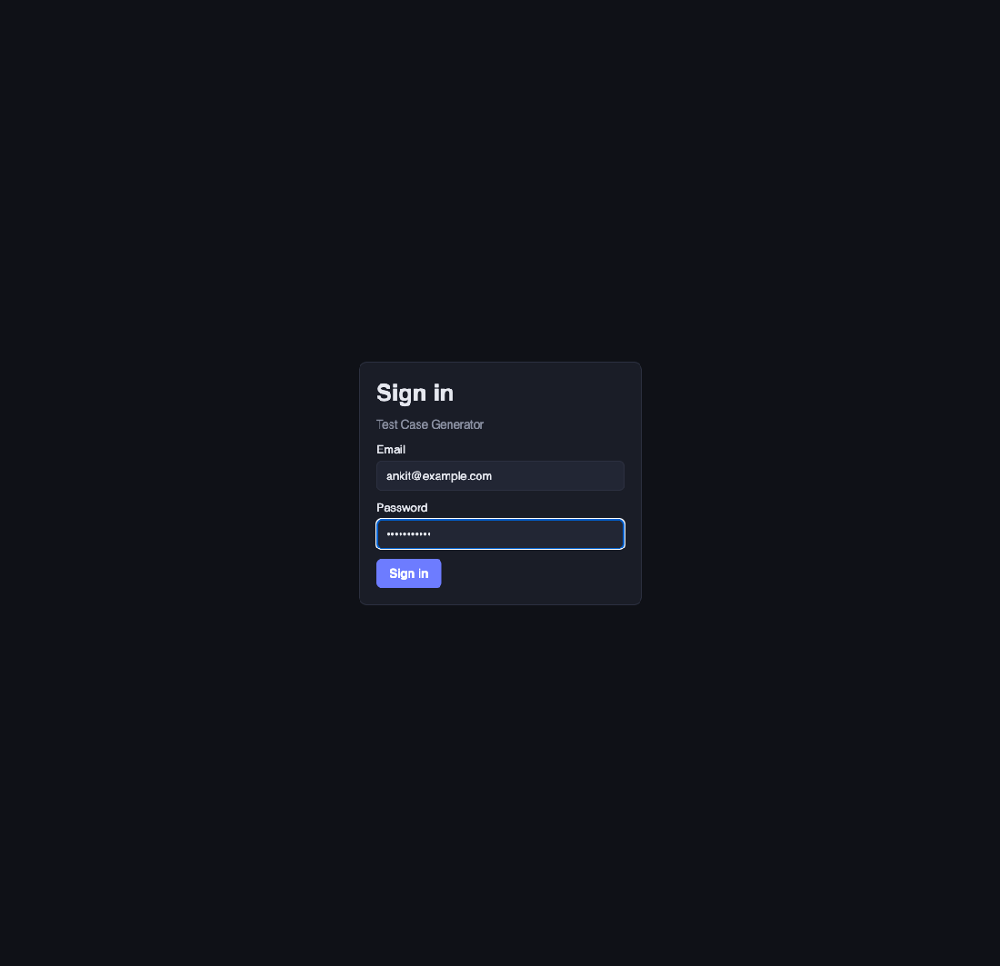
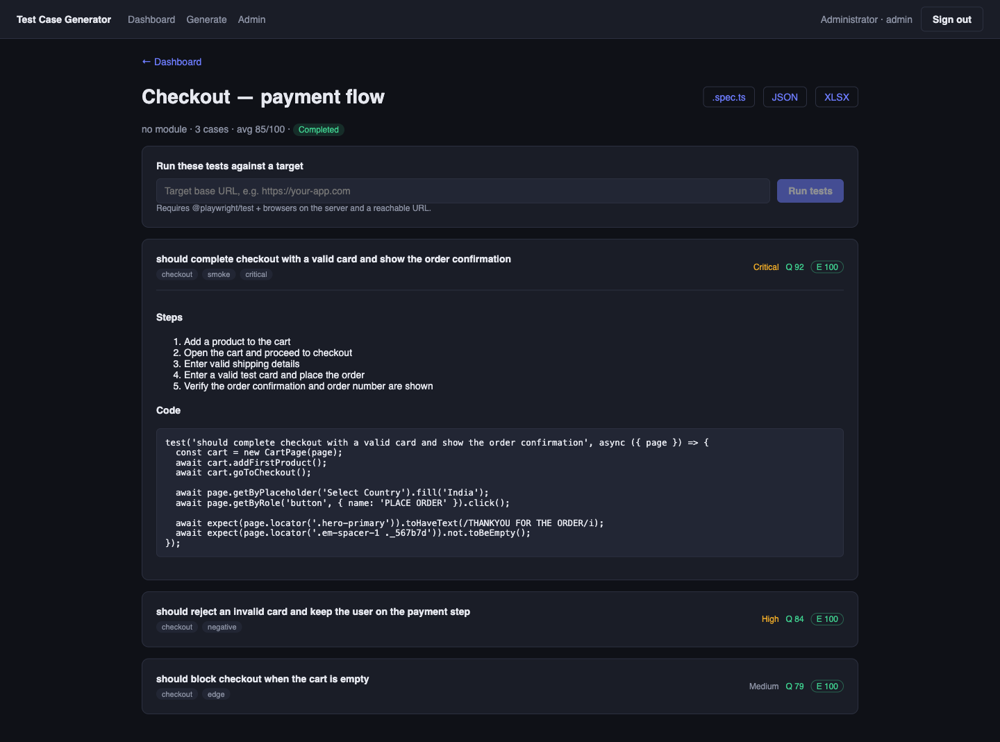
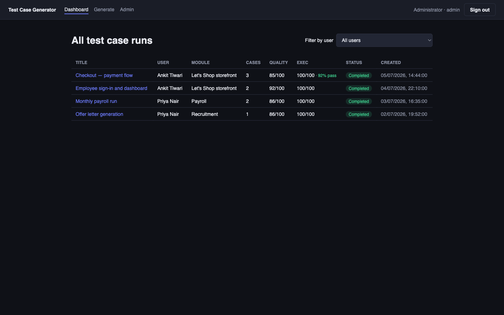

# QA-FORGE

**A test-case generator you can import, run from the CLI, or use as a web app.**

[](https://www.npmjs.com/package/@ankit-at/qaforge)
[](https://github.com/ankit-at/QA-FORGE/actions/workflows/ci.yml)
[](LICENSE)

```bash
npm install @ankit-at/qaforge
```

Turns requirements into production-ready test cases. It parses and enriches each
unit of work, builds a focused prompt, generates a test through an LLM, scores
the result with an LLM-as-judge pass, and outputs Playwright specs, JSON
metadata and an XLSX export.



It ships in three forms:

- **Library** — `import { generateTestCases } from "@ankit-at/qaforge"` and
  generate cases from your own code.
- **CLI** — feed it a structured *skills inventory* JSON (see below).
- **Web UI** — log in, upload a BRD PDF, pick a module context and scope, and
  generate + track test cases from the browser.

```
BRD PDF ──▶ extract ──▶ Skills ──▶ Parser ──▶ Prompt ──▶ LLM ──▶ Evaluator ──▶ Formatter ──▶ Files
 (UI)      text→skills           enrich     builder     gen     score/refine   spec/json/xlsx
```

## Use as a library

Install it and call it from your own code — no server or UI required.

```bash
npm install @ankit-at/qaforge   # or: npm install github:ankit-at/QA-FORGE
```

```ts
import { generateTestCases, OutputFormatter } from "@ankit-at/qaforge";

const skills = [
  {
    skillId: "CART_001",
    skillName: "Add a product to the cart",
    actionType: "Click",
    steps: ["Open a product", "Click Add to Cart", "Verify the cart count"],
    expectedResult: "The cart count increments by one.",
  },
];

const { testCases, errors } = await generateTestCases(skills, {
  apiKey: process.env.ANTHROPIC_API_KEY, // or set the env var
  preset: "standard",                    // minimal | standard | comprehensive
});

// Render however you like:
const spec = new OutputFormatter().formatPlaywright(testCases);
```

Straight from a **skills inventory** (JSON string or parsed array):

```ts
import { generateFromInventory } from "@ankit-at/qaforge";
const { testCases } = await generateFromInventory(jsonString, { preset: "standard" });
```

Straight from **requirements text** (e.g. a BRD you've already converted to
text) — it extracts a skills inventory first, then generates and scores:

```ts
import { generateFromText } from "@ankit-at/qaforge";

const { skills, testCases } = await generateFromText(
  {
    text: brdText,
    title: "Checkout — payment flow",
    moduleContext: "Angular storefront; shoppers authenticate then check out.",
    scopeTypes: ["Functional", "Negative / Edge"],
  },
  { preset: "comprehensive" }
);
```

### API surface

| Export | Purpose |
|--------|---------|
| `generateTestCases(skills, options)` | Generate from a flat `Skill[]` |
| `generateFromInventory(json \| categories, options)` | Generate from a skills inventory |
| `generateFromText(input, options)` | Requirements text → skills → scored cases |
| `extractSkillsFromText(input, apiKey?)` | Just the requirements → skills step |
| `TestCaseGenerator` | Class for full control over batching/refinement |
| `OutputFormatter` | Render to Playwright / JSON / XLSX |
| `EvaluationEngine`, `SkillParser`, `PromptBuilder`, `ClaudeClient` | Building blocks |
| `ConfigManager`, `DEFAULT_CONFIG`, `PRESETS` | Config and presets |

`options`: `{ apiKey?, preset?, config?, goldenExamples?, appContext? }`. All
functions resolve the API key from `options.apiKey` or `ANTHROPIC_API_KEY`.
Generation never throws on a single failed skill — failures are collected in the
returned `errors` array. Ships with TypeScript types.

## Web UI

A React + Vite frontend over an Express + SQLite backend, reusing the same
generation core.

- **Roles.** An **admin** manages users and the module-context library, and sees
  every run across all users with a per-user filter. A **generator** logs in,
  creates runs, and sees only their own.
- **Generate flow.** Title → upload BRD PDF (text is extracted and previewed) →
  select a module context (admin-authored) → choose scope (functional,
  non-functional, security, performance, usability, negative/edge) + free-text
  notes → generate. Results land on a dashboard with `.spec.ts` / JSON / XLSX
  downloads per run.

### Screenshots

| Generate flow | Run detail |
|---|---|
|  |  |

| Admin dashboard (all users) | Module contexts |
|---|---|
|  |  |

### Run it

```bash
npm install
cp .env.example .env          # set ANTHROPIC_API_KEY, JWT_SECRET, ADMIN_* 
npm run app                   # API on :3001 + Vite dev server on :5173
```

Open http://localhost:5173 and sign in with the seed admin (`ADMIN_EMAIL` /
`ADMIN_PASSWORD` from `.env`, created on first boot). Create generator users and
add module contexts under **Admin**.

Production single-server mode: `npm run web:build` then `npm run server` serves
the built UI from the API process.

| Piece | Location |
|-------|----------|
| Backend (auth, SQLite, routes, BRD pipeline) | `server/` |
| Frontend (React pages) | `web/` |
| Generation core (shared with CLI) | `src/` |

## CLI

```
Skills JSON ──▶ Parser ──▶ Prompt Builder ──▶ LLM ──▶ Evaluator ──▶ Formatter ──▶ Files
                 enrich       system+user      gen      score/refine    spec / json / xlsx
```

## Why

QA teams already describe what a feature should do as a list of discrete,
testable skills. This tool consumes that description directly and produces the
first draft of the automation, so the manual step becomes *review* instead of
*author from scratch*.

## Install

```bash
git clone https://github.com/ankit-at/QA-FORGE.git
cd QA-FORGE
npm install
cp .env.example .env   # then add your ANTHROPIC_API_KEY
```

## Usage

```bash
# Run against the bundled example
npm run dev -- --source examples/skills-inventory.json --preset standard

# With few-shot golden examples
npm run dev -- --source examples/skills-inventory.json --golden examples/golden-dataset.json

# Skip evaluation for a fast pass
npm run dev -- --preset minimal --no-eval

# Build and run the compiled CLI
npm run build
node dist/cli.js --source examples/skills-inventory.json
```

### Options

| Flag | Default | Description |
|------|---------|-------------|
| `--source` | `examples/skills-inventory.json` | Skills inventory JSON |
| `--preset` | `standard` | `minimal` \| `standard` \| `comprehensive` |
| `--out` | `output` | Output directory |
| `--golden` | – | Golden dataset JSON for few-shot prompting |
| `--no-eval` | off | Skip the scoring/refinement pass |

Environment: `ANTHROPIC_API_KEY` (required), `TCGEN_MODEL`, `TCGEN_MAX_TOKENS`,
`TCGEN_TEMPERATURE` (optional overrides).

## Input format

A skills inventory is an array of categories, each holding atomic skills:

```json
[
  {
    "categoryId": "NAV001",
    "categoryName": "Navigation & Authentication",
    "skills": [
      {
        "skillId": "NAV_001_001",
        "skillName": "Navigate to Home Dashboard",
        "actionType": "Navigation",
        "steps": ["Navigate to ...", "Verify ... is visible"],
        "expectedResult": "Dashboard loads with all regions visible.",
        "elementSelectors": { "homeButton": "button[aria-label='HOME']" }
      }
    ]
  }
]
```

Each skill is an atomic, testable unit: `steps` are user actions,
`expectedResult` is a measurable outcome, and `elementSelectors` / `testData`
are optional but improve output quality.

## Output

Written to the `--out` directory:

- `generated.spec.ts` — Playwright test file
- `test-cases.json` — structured metadata (steps, assertions, tags, priority, score)
- `test-cases.xlsx` — spreadsheet export for review
- `quality-report.json` — aggregate scores and recommendations

## Architecture

| Module | Responsibility |
|--------|----------------|
| `core/skillParser.ts` | Validate JSON, enrich skills (complexity, tags, dependencies) |
| `core/promptBuilder.ts` | Build generation, evaluation and refinement prompts |
| `core/claudeClient.ts` | LLM calls, JSON extraction, retry with backoff |
| `generation/generator.ts` | Orchestrate batches, evaluate, refine low scorers |
| `generation/outputFormatter.ts` | Render Playwright / JSON / XLSX |
| `evaluation/evaluator.ts` | LLM-as-judge scoring and quality report |
| `config/configManager.ts` | Presets and defaults |

## Presets

- **minimal** — happy-path only, functional style, no evaluation. Fastest.
- **standard** — comprehensive coverage, page-object style, evaluation on.
- **comprehensive** — all scenarios, lower temperature for consistency.

Low-scoring tests (below the configured threshold, default 75) are automatically
refined once using the evaluator's feedback, and the higher-scoring version is kept.

## Scoring & accuracy

Every generated case carries two signals:

- a **quality score** (0–100) from an LLM-as-judge pass (coverage, clarity,
  automation-readiness, completeness, maintainability), and
- an **executability score** — a deterministic check that the spec compiles, is
  a real test with assertions, and avoids flaky patterns (`execution` field /
  `validateSpec()`).

For true **execution accuracy**, `runPlaywrightSpecs()` runs the generated specs
against your app and reports pass / fail / flaky and a pass rate. See
[`docs/accuracy.md`](docs/accuracy.md) for the full layered approach (rubric →
executability → execution → coverage → human acceptance).

```ts
import { validateSpec, runPlaywrightSpecs } from "@ankit-at/qaforge";

validateSpec(code);                              // { compiles, hasAssertions, executabilityScore, ... }
await runPlaywrightSpecs({ projectDir: "./e2e" }); // { passed, failed, flaky, passRate, ... }
```

## Security

- **`JWT_SECRET` is required** (min 16 chars). The server refuses to issue or
  verify tokens without it — no insecure fallback. Generate one with
  `openssl rand -base64 32`.
- **No default admin password.** On first boot, if `ADMIN_PASSWORD` is unset or
  weak, a strong random password is generated and printed to the server console
  once. Change it after first login.
- **Login is rate-limited** (10 attempts / 15 min / IP) to slow credential
  guessing. Passwords are bcrypt-hashed; a minimum length of 8 is enforced.
- **CORS is an allowlist** via `CORS_ORIGIN` (defaults to the local dev UI).
- **Security headers** are set with `helmet`. All SQL uses parameterized
  prepared statements. Internal error details are logged server-side, not
  returned to clients.
- `.env`, the SQLite database, and uploads are gitignored and never committed.

Residual notes for a hosted deployment:

- The JWT is stored in `localStorage`, so an XSS bug would expose it. Acceptable
  for a local/single-team tool; move to an httpOnly cookie if you host it
  publicly.
- Serve over HTTPS behind a reverse proxy (the `Strict-Transport-Security`
  header assumes TLS termination).
- BRD text is passed to the LLM; treat generated output as untrusted if you ever
  ingest third-party BRDs (prompt-injection surface).
- `npm audit` reports a moderate transitive advisory in `uuid` (via `exceljs`);
  the fix is a breaking `exceljs` downgrade, so it is tracked rather than forced.

## Releasing

The npm package publishes automatically from GitHub Actions
(`.github/workflows/publish-npm.yml`) when you push a version tag or run the
workflow manually. It needs the repo secret `NPM_TOKEN`.

```bash
# bump the version in package.json first, then:
git tag v1.0.1
git push origin v1.0.1
```

`CI` (`.github/workflows/ci.yml`) builds and typechecks on every push/PR.

## License

MIT
